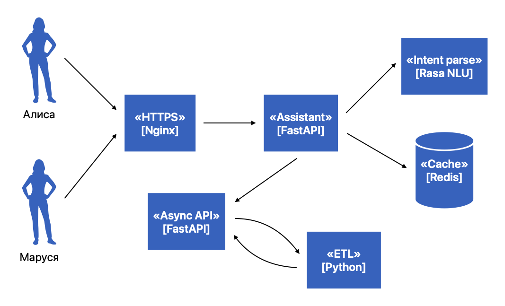
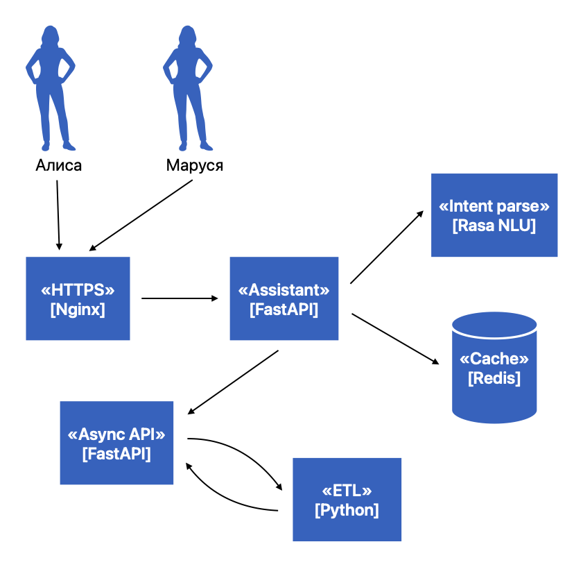

> Ассистент
-- команда #8

---

## Архитектура



---

## Архитектура



- Nginx
  - Высокая производительность
  - Балансировка нагрузки
  - Простота конфигурации

---

## Архитектура


- FastAPI
  - Высокая производительность
  - Валидация данных
  - Автоматическая документация

---

## Архитектура


- Redis
  - Высокая производительность
  - Масштабируемость
  - Простой в использовании

---

## Архитектура


- Rasa NLU
  - Низкий порог входа
  - Возможность создавать собственные модели
  - Обучение на малом объеме данных
  - Работа в виде библиотеки и отдельного сервиса

---

## Архитектура


- Реализованные ранее
  - Async API
  - ETL

---

## Service «Assistant»


---

## Model Rasa NLU

```yaml
- intent: film_length
  examples: |
   - сколько длится фильм [Сто дней после детства](film)
   - сколько длится [Спящая красавица](film)
   - продолжительность фильма [Чужие из бездны](film)
   - продолжительность [джонни мнемоника](film)
   - сколько идет фильм [рок на века](film)

- intent: film_director
  examples: |
   - кто режиссер фильма [Матрица](film)
   - режиссер фильма [бульвар](film)
   - кто режиссировал [брат](film)
   - кто режиссировал фильм [бульвар спасения](film)   
```


---

## Контроль качества

```yaml
- GitHub:
  - Actions:
    - pull_request:
      - flake8
      - tests
```

---

## Демонстрация


---

## Можно лучше

- Проработка модели NLU
- Обработка числительных
- Форматирование ответов с учетом феминитивов

---

# Всё 🤠
